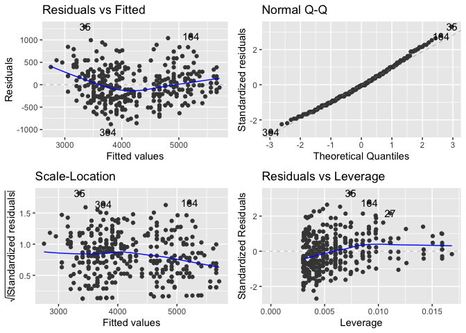

STA 210
================

``` r
library(tidyverse)
library(tidymodels)
library(palmerpenguins)

penguins <- drop_na(penguins)
```

## Simple linear regression

### Model fitting

``` r
slr_fit <- linear_reg() |>
  set_engine("lm") |>
  fit(body_mass_g ~ flipper_length_mm, data = penguins)
```

### Model summary

``` r
tidy(slr_fit)
```

    # A tibble: 2 × 5
      term              estimate std.error statistic   p.value
      <chr>                <dbl>     <dbl>     <dbl>     <dbl>
    1 (Intercept)        -5872.     310.       -18.9 1.18e- 54
    2 flipper_length_mm     50.2      1.54      32.6 3.13e-105

### Model evaluation

``` r
glance(slr_fit)
```

    # A tibble: 1 × 12
      r.squared adj.r.squared sigma statistic   p.value    df logLik   AIC   BIC
          <dbl>         <dbl> <dbl>     <dbl>     <dbl> <dbl>  <dbl> <dbl> <dbl>
    1     0.762         0.761  393.     1060. 3.13e-105     1 -2461. 4928. 4940.
    # … with 3 more variables: deviance <dbl>, df.residual <int>, nobs <int>

### Prediction

For new data:

``` r
new_penguin <- tibble(flipper_length_mm = 172)
predict(slr_fit, new_penguin)
```

    # A tibble: 1 × 1
      .pred
      <dbl>
    1 2754.

For data used to fit the model:

::: callout-warning Which of the following, if any, to use? I wish
`augment(slr_fit)` worked… :::

``` r
augment(slr_fit) # wish it worked
```

    Error in augment.model_fit(slr_fit): argument "new_data" is missing, with no default

``` r
augment(slr_fit$fit) # avoid this
```

    # A tibble: 333 × 8
       body_mass_g flipper_length_mm .fitted  .resid    .hat .sigma     .cooksd
             <int>             <int>   <dbl>   <dbl>   <dbl>  <dbl>       <dbl>
     1        3750               181   3206.  544.   0.00912   393. 0.00889    
     2        3800               186   3456.  344.   0.00644   393. 0.00249    
     3        3250               195   3908. -658.   0.00355   392. 0.00500    
     4        3450               193   3807. -357.   0.00398   393. 0.00166    
     5        3650               190   3657.   -7.03 0.00485   394. 0.000000781
     6        3625               181   3206.  419.   0.00912   393. 0.00528    
     7        4675               195   3908.  767.   0.00355   392. 0.00680    
     8        3200               182   3256.  -55.8  0.00852   394. 0.0000872  
     9        3800               191   3707.   92.8  0.00453   394. 0.000127   
    10        4400               198   4058.  342.   0.00314   393. 0.00119    
    # … with 323 more rows, and 1 more variable: .std.resid <dbl>

``` r
augment(slr_fit, new_data = penguins) # needs good articulation why it's diferent than tidy() and glance()
```

    # A tibble: 333 × 10
       species island    bill_length_mm bill_depth_mm flipper_length_mm body_mass_g
       <fct>   <fct>              <dbl>         <dbl>             <int>       <int>
     1 Adelie  Torgersen           39.1          18.7               181        3750
     2 Adelie  Torgersen           39.5          17.4               186        3800
     3 Adelie  Torgersen           40.3          18                 195        3250
     4 Adelie  Torgersen           36.7          19.3               193        3450
     5 Adelie  Torgersen           39.3          20.6               190        3650
     6 Adelie  Torgersen           38.9          17.8               181        3625
     7 Adelie  Torgersen           39.2          19.6               195        4675
     8 Adelie  Torgersen           41.1          17.6               182        3200
     9 Adelie  Torgersen           38.6          21.2               191        3800
    10 Adelie  Torgersen           34.6          21.1               198        4400
    # … with 323 more rows, and 4 more variables: sex <fct>, year <int>,
    #   .pred <dbl>, .resid <dbl>

``` r
predict(slr_fit, new_data = penguins)
```

    # A tibble: 333 × 1
       .pred
       <dbl>
     1 3206.
     2 3456.
     3 3908.
     4 3807.
     5 3657.
     6 3206.
     7 3908.
     8 3256.
     9 3707.
    10 4058.
    # … with 323 more rows

### Inference

#### Simulation-based inference

Confidence interval for the slope:

::: callout-warning Since earlier we did `fit (y ~ x, data)` it’s odd to
switch gears here and do `specify()` and then `fit()`. I wonder if
starting with tidymodels to begin with it’s better not at all to
introduce infer? What would be the alternative way of doing the
following in tidymodels then? :::

``` r
set.seed(1120)

observed_fit <- penguins |>
  specify(body_mass_g ~ flipper_length_mm) |>
  fit()

boot_fits <- penguins |>
  specify(body_mass_g ~ flipper_length_mm) |>
  generate(reps = 100, type = "bootstrap") |>
  fit()

get_confidence_interval(
  boot_fits, 
  point_estimate = observed_fit, 
  level = 0.95,
  type = "percentile"
)
```

    # A tibble: 2 × 3
      term              lower_ci upper_ci
      <chr>                <dbl>    <dbl>
    1 flipper_length_mm     47.3     52.8
    2 intercept          -6410.   -5297. 

Hypothesis test for the slope:

``` r
set.seed(1234)

null_dist <- penguins |>
  specify(body_mass_g ~ flipper_length_mm) |>
  hypothesize(null = "independence") |>
  generate(reps = 100, type = "permute") |>
  fit()

get_p_value(
  null_dist,
  obs_stat = observed_fit,
  direction = "two-sided"
)
```

    Warning: Please be cautious in reporting a p-value of 0. This result is an
    approximation based on the number of `reps` chosen in the `generate()` step. See
    `?get_p_value()` for more information.

    Warning: Please be cautious in reporting a p-value of 0. This result is an
    approximation based on the number of `reps` chosen in the `generate()` step. See
    `?get_p_value()` for more information.

    # A tibble: 2 × 2
      term              p_value
      <chr>               <dbl>
    1 flipper_length_mm       0
    2 intercept               0

Other inference

::: callout-warning How do we do these with tidymodels and in a
simulation-based way?

-   Confidence interval for a new prediction
-   Prediction interval for a new prediction :::

#### Theoretical inference

Confidence interval and hypothesis test for the slope:

``` r
tidy(slr_fit, conf.int = TRUE)
```

    # A tibble: 2 × 7
      term              estimate std.error statistic   p.value conf.low conf.high
      <chr>                <dbl>     <dbl>     <dbl>     <dbl>    <dbl>     <dbl>
    1 (Intercept)        -5872.     310.       -18.9 1.18e- 54  -6482.    -5262. 
    2 flipper_length_mm     50.2      1.54      32.6 3.13e-105     47.1      53.2

::: callout-warning What is the recommended way to do diagnostic plots
for theoretical inference, especially since `augment()` is not designed
to be used with the full data? :::

``` r
library(ggfortify)
```

    Registered S3 method overwritten by 'ggfortify':
      method          from   
      autoplot.glmnet parsnip

``` r
autoplot(slr_fit)
```



Confidence interval for a new prediction:

``` r
predict(slr_fit, new_data = new_penguin, type = "conf_int")
```

    # A tibble: 1 × 2
      .pred_lower .pred_upper
            <dbl>       <dbl>
    1       2657.       2852.

Prediction interval for a new prediction:

``` r
predict(slr_fit, new_data = new_penguin, type = "pred_int")
```

    # A tibble: 1 × 2
      .pred_lower .pred_upper
            <dbl>       <dbl>
    1       1974.       3534.

## Multiple linear regression

## Logistic regression

## Multinomial logistic regression
